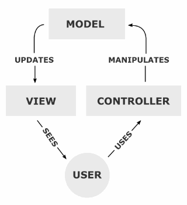
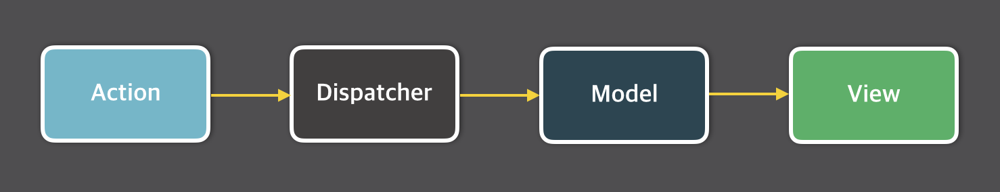

# Flux 패턴이란?

Flux 패턴은 2014년 페이스북 F8 컨퍼런스에서 발표된 아키텍처로 Client-Side 웹 애플리케이션을 만들기 위해 사용하는 디자인 패턴이다.

## 왜 생긴걸까?

대규모 애플리케이션에서 데이터 흐름을 일관성 있게 관리함으로써 프로그램의 예측가능성(Prdictability)을 높이기 위해서이다.<br/>기존의 애플리케이션들이 보편적으로 사용하던 MVC 패턴을 보자

MVC는 Model, View, Controller의 약자이다. Model에 데이터를 저장하고 Controller를 이용하여 Model의 데이터를 관리합니다. Model의 데이터가 변경되면 View로 전달되어 사용자에게 보여집니다. 또한 중요한 점은 사용자가 데이터를 입력하면 Model을 업데이트 시킬수 있습니다. 즉 데이터가 양방향으로 흐를수 있습니다. 이렇게 보면 좋아보이지만 만약 애플리케이션의 규모가 매우 커지고 구조가 복잡해 진다면 View가 다양한 상호작용을 위해 여러개의 Model을 동시에 업데이트하고 Model 역시 여러개의 View에 데이터를 전달하는 복잡한 상황이 발생한다. 이러한 문제를 해결하기 위한 방안이 Flux 패턴이다.

## Flux 패턴

Flux는 사용자 입력을 기반으로 Action을 만들고 Action을 Dispatcher에 전달하여 Model의 데이터를 변경한 뒤 View에 반영하는 단방향의 흐름으로 에플리케이션을 만드는 아키텍처이다.


### Action

Action이란 데이터를 변경하는 행위로서 Dispatcher에게 전달되는 객체이다. 새로 발생한 Action의 type과 payload(새로운 데이터)를 묶어서 Dispatcher에 전달한다.

### Dispatcher

Dispatcher는 모든 데이터의 흐름을 관리하는 중앙 허브이다. Dispatcher에는 Model들이 등록해놓은 Action 타입마다 콜백 함수들이 존재한다. Action을 감지하면 Model들이 각 타입에 맞는 Model의 콜백 함수를 실행한다. Store의 데이터를 조작하는건 옺기 Dispatcher를 통해서만 가능하다. 또한 Model들 사이에 의존성이 있는 상황에서도 순서에 맞게 콜백 함수를 순차적으로 처리할 수 있도록 관리한다.

### Model

Store는 상태 저장소로 상태와 상태를 변경할 수 있는 메서드를 가지고 있다. 어떤 타입의 Action이 발생했는지에 따라 그에 맞는 데이터 변경을 수행하는 콜백 함수를 Dispatcher에 등록한다. Dispatcher에서 콜백 함수를 실행하여 상태가 변경되면 View에게 데이터가 변경되었음을 알린다.

### View

View는 리액트 컴포넌트로 생각하면 된다. Model에서 View에게 상태가 변경되었음을 알려주면 Controller View(최상위 View)는 Store에서 데이터를 가져와 자식 View에게 내려보낸다. 새로운 데이터를 받은 View는 화면을 리렌더링한다. 또한 사용자가 View에 어떠한 조작을 하면 그에 해당하는 Action을 생성한다.

```toc

```

<script src="https://utteranc.es/client.js"
        repo="alpaka206/alpaka206.github.io"
        issue-term="pathname"
        label="utterances"
        theme="github-light"
        crossorigin="anonymous"
        async>
</script>
